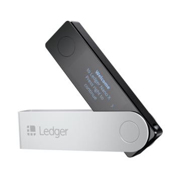

# Ledger Overview

## Quick Access Navigation

| Ledger Live                                                                                         | Ledger Nano S                               | Ledger Nano X                               |
|:-----------------------------------------------------------------------------------------------------:|:---------------------------------------------:|:---------------------------------------------:|
| |   |  |
| [Ledger Live Guides](../Ledger/LedgerLive/LedgerLiveOverview.md)     | [Ledger Nano S Guides](../Ledger/LedgerNanoS/LedgerNanoSOverview.md)                   | [Ledger Nano X Guides](../Ledger/LedgerNanoX/LedgerNanoXOverview.md)                   |
| Ledger Live is the new way to manage your Ledger device and all of your crypto assets in one place. | The Ledger Nano S is a Bitcoin, Ethereum and Altcoins hardware wallet. This device is built on robust safety features for storing cryptographic assets and securing digital payments.                                            | The Ledger Nano X builds on industry standards to bring to you a sleek, fully mobile and secure hardware wallet.                                            |

## Information

A fast paced, growing company developing security and infrastructure solutions for cryptocurrencies
as well as blockchain applications for individuals and companies,
by leveraging a distinctive, proprietary technology.

Ledger designed three wallets: the light Ledger Nano S, the touchscreen Ledger Blue and the portable Ledger Nano X which can both support directly 23 cryptocurrencies, and dozens more via third party applications.

Founded in 2014, Ledger is a leader in security and infrastructure solutions for cryptocurrencies and blockchain applications. Headquartered in Paris, Vierzon, New York, San Francisco and Hong Kong, Ledger has a team of over 200 professionals developing a variety of products and services to safeguard cryptocurrency assets for individuals and companies – including the Ledger hardware wallets line already sold in 165 countries.

## Additional Access Navigation
| Compatible Cryptocurrencies                                                                                         | Ledger Refunds and returns                               | Third Party Application Help                               |
|:-----------------------------------------------------------------------------------------------------:|:---------------------------------------------:|:---------------------------------------------:|
| |   |  |
| [Compatible Cryptocurrencies](../Ledger/CompatibleCryptocurrencies.md)     | [Ledger Refunds and returns help](../Ledger/LedgerWarrantyReturns/LedgerRMAProcedure.md)                   | [Third Party Wallet Guides](../CompatibleCryptocurrencies/#third-party-wallet-applications)                   |
| See a list of all Cryptocurrencies compatible with the Ledger Devices. | See information on Ledgers Refunds and Returns policy.                                            | See a list of the all the third party wallets available for the Ledger devices and guides associated with them.                                            |
